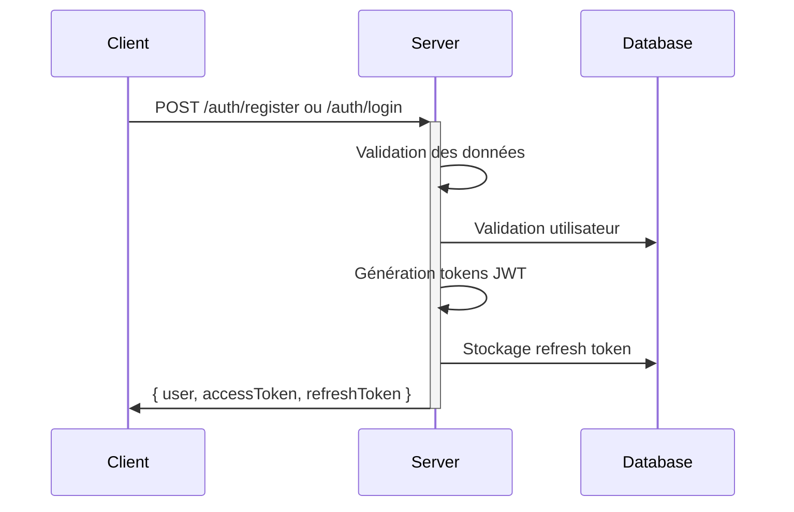
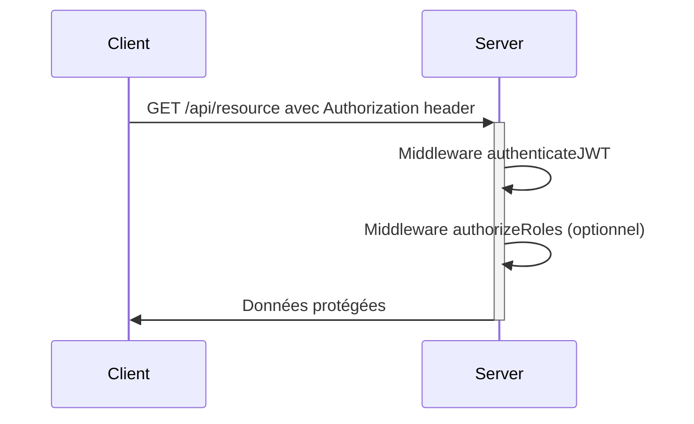
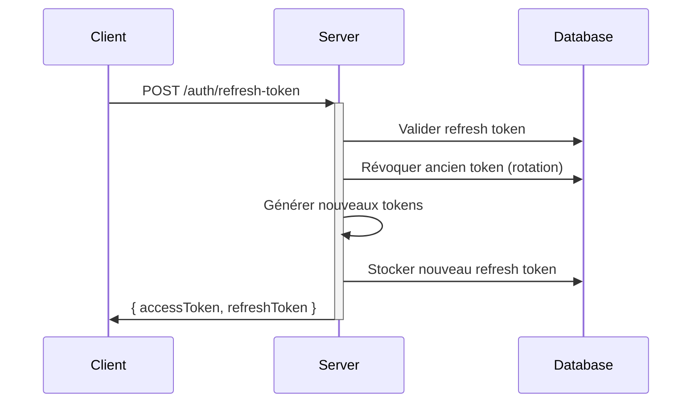

# RoadBook Authentication System

## Vue d'ensemble

Le système d'authentification RoadBook utilise une approche à **double token** pour garantir la sécurité et l'expérience utilisateur:

- **Access Token**: JWT de courte durée (15 min) pour l'autorisation API
- **Refresh Token**: Token de longue durée (7 jours) stocké en base de données et utilisé pour rafraîchir l'access token
- **Rotation des tokens**: Un nouveau refresh token est généré à chaque utilisation, l'ancien est révoqué

## Flux d'authentification

### 1. Inscription et connexion


### 2. Accès aux ressources protégées


### 3. Rafraîchissement du token


## Implémentation technique

### Middlewares principaux

1. **authenticateJWT**: Vérifie le token d'accès et extrait les informations utilisateur
2. **authorizeRoles**: Vérifie que l'utilisateur a les rôles requis pour accéder à une ressource
3. **optionalAuth**: Authentifie si un token est fourni mais n'échoue pas si absent

### Sécurité renforcée

- **Hachage des mots de passe**: bcrypt avec coût adaptatif (10-12 rounds)
- **Détection de réutilisation de tokens**: Si un token révoqué est utilisé, tous les tokens utilisateur sont révoqués
- **Rate limiting**: Limitation des tentatives échouées (5 max), blocage temporaire après échec
- **Validation stricte**: Zod pour validation des entrées et normalisation
- **Cookies sécurisés**: HttpOnly, secure, sameSite options pour les refresh tokens

### Validation en entrée (Zod)

Exemple de schéma de validation pour l'enregistrement:
```typescript
const registerSchema = z.object({
  email: z.string().email().toLowerCase().trim(),
  password: z.string()
    .min(8, "Password must be at least 8 characters")
    .regex(/[A-Z]/, "Password must contain uppercase")
    .regex(/[0-9]/, "Password must contain a number")
    .regex(/[!@#$%^&*(),.?":{}|<>]/, "Password must contain a special character"),
  displayName: z.string().min(2).max(50).trim(),
  // Autres champs avec validation
});
```

## Modèles et relations

```
User {
  id, email, passwordHash, displayName, role...
  --relations--
  refreshTokens: RefreshToken[]
  passwordResets: PasswordReset[]
}

RefreshToken {
  id, token, userId, revoked, expiresAt, createdAt
  --relations--
  user: User
}

PasswordReset {
  id, token, userId, revoked, expiresAt, createdAt
  --relations--
  user: User
}
```

## Endpoints d'authentification

| Endpoint | Méthode | Description | Authentification |
|----------|---------|-------------|------------------|
| `/api/auth/register` | POST | Inscription | Non |
| `/api/auth/login` | POST | Connexion | Non |
| `/api/auth/logout` | POST | Déconnexion | Non* |
| `/api/auth/refresh-token` | POST | Rafraîchissement | Non* |
| `/api/auth/verify` | GET | Vérification token | Non* |
| `/api/auth/forgot-password` | POST | Demande réinitialisation | Non |
| `/api/auth/reset-password` | POST | Réinitialisation mot de passe | Non |

*Ces endpoints ne nécessitent pas d'authentification formelle mais requièrent des tokens valides

## Rôles et permissions

Le système implémente un contrôle d'accès basé sur les rôles (RBAC) avec 4 rôles principaux:

1. **APPRENTICE**: Utilisateur standard (apprenant)
   - Accès à ses propres roadbooks et données
   - Peut créer des roadbooks et sessions

2. **GUIDE**: Mentor/accompagnateur
   - Tout ce que peut faire un APPRENTICE
   - Accès aux roadbooks où il est assigné comme guide
   - Peut valider des sessions et compétences

3. **INSTRUCTOR**: Instructeur professionnel
   - Tout ce que peut faire un GUIDE
   - Privilèges supplémentaires pour l'évaluation officielle

4. **ADMIN**: Administrateur système
   - Accès complet à toutes les ressources
   - Gestion des utilisateurs et configurations

## Tests d'authentification

Les tests couvrent:
- Inscription et validation des données
- Connexion avec identifiants corrects/incorrects
- Gestion des tokens (génération, rotation, révocation)
- Protection des routes avec middlewares d'authentification
- Limitation des tentatives de connexion
- Réinitialisation de mot de passe

## Comptes de test pré-configurés

| Email | Mot de passe | Rôle |
|-------|-------------|------|
| `apprentice@roadbook.com` | `Password123!` | APPRENTICE |
| `guide@roadbook.com` | `Password123!` | GUIDE |
| `instructor@roadbook.com` | `Password123!` | INSTRUCTOR |
| `admin@roadbook.com` | `Password123!` | ADMIN |

## Intégration côté client

Les clients doivent:
1. Stocker l'access token en mémoire (jamais en localStorage pour les applications web)
2. Stocker le refresh token sécurisé (cookie HttpOnly ou stockage sécurisé natif)
3. Implémenter le rafraîchissement automatique lorsque l'access token expire
4. Ajouter l'access token à chaque requête API (Authorization header)

## Recommandations pour l'évolution

- Implémentation de JWT à signature asymétrique (RS256) pour environnements distribués
- Ajout de la clé PASETO comme alternative aux JWT pour une sécurité renforcée
- Support d'authentification multi-facteurs (MFA/2FA)
- Intégration d'OAuth2 pour authentification tierce (Google, Apple, etc.)
- Suivi des sessions actives par utilisateur